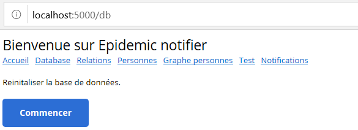
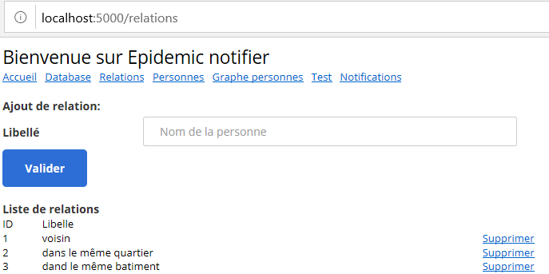
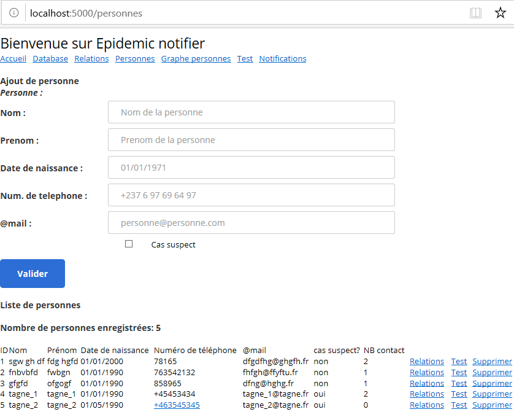
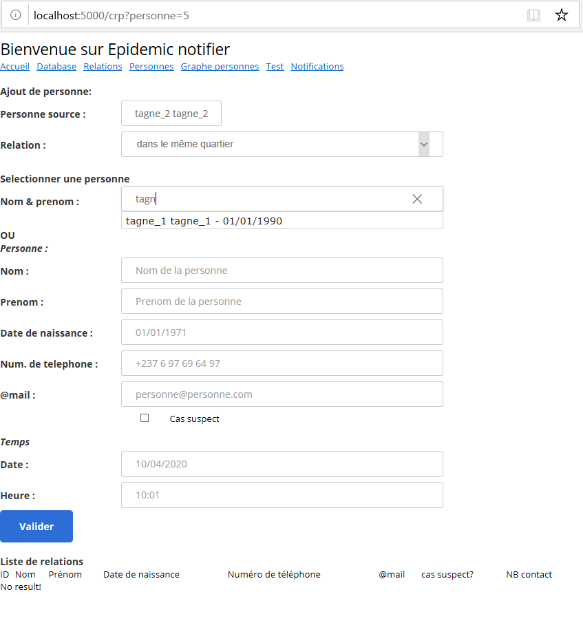
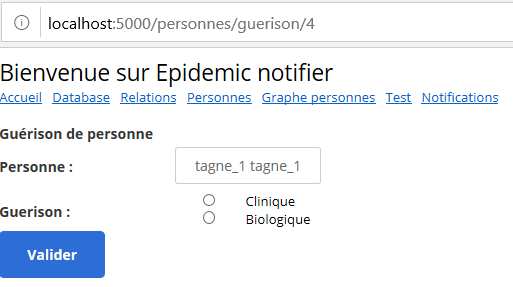
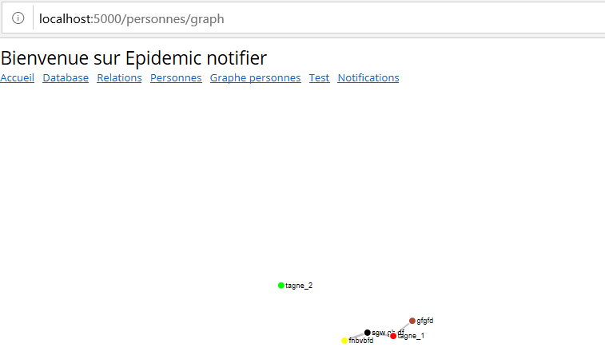
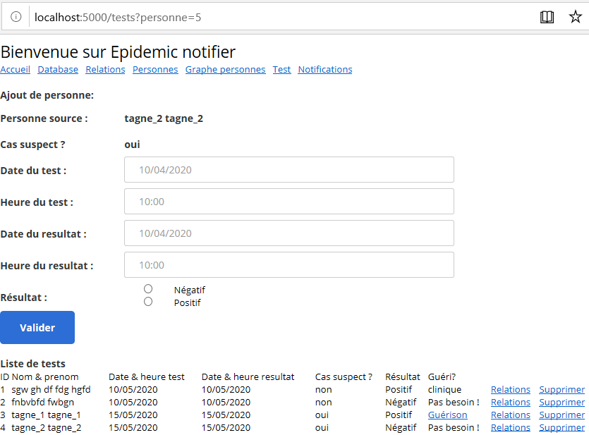
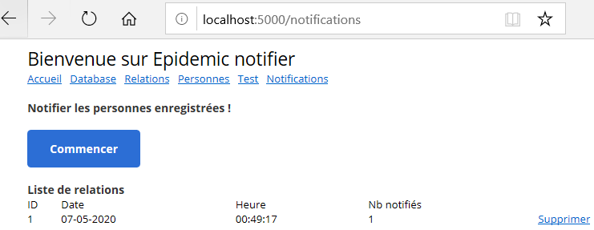
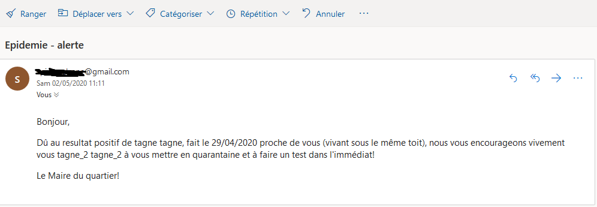
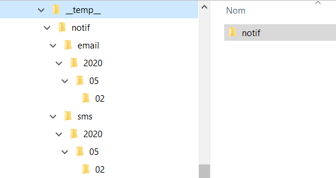

# Overview

During an epidemic period, manage the people in contact and notify them when the test result is positive!

You can easily manage:
- the database: reset data;
- "relations";
- "personnes" and you have a graph realized with the [D3.js v4 Force Directed Graph with Labels](https://bl.ocks.org/heybignick/3faf257bbbbc7743bb72310d03b86ee8) project;
- "tests" ;
- "notifications".

## Benefits 

* Grouping people data.

* Notify people by sms/email when a positive test result is detected.

* Reset the database anytime you want.

## Getting Started

These instructions will get you a copy of the project up and running on your local machine for development and testing purposes. See deployment for notes on how to deploy the project on a live system.

- Rename "init.env" to ".env"
- Edit ".env" file and put the right values.
- Account to log in: medec1 / medec1


Log on to [Gmail](http://www.gmail.com) and activate the option ["Less secure access to applications" ]( https://myaccount.google.com/lesssecureapps ).

### Prerequisites

* Windows 7+ or Linux kernel version 3.10 or higher
* 2.00 GB of RAM
* 3.00 GB of available disk space

Use with Docker http://www.docker.io

### Installation

Pull Docker image on your computer and run:
```
docker pull atchopba/epidemic-notifier

docker run -d -p 5000:5000 --name epidemic-notifier atchopba/epidemic-notifier
```
OR 

You can build a Dcker image on your computer and run :
```
docker build -t epidemic-notifier .

docker run -p 5000:5000 epidemic-notifier
```
Finally, go to your web browser: http://localhost:5000/

#### Screenshots
1. When lauching page in your web browser, you arrive to the log in page. (medec1/medec1) to log in.


Then, the home page.


2. Tab "Database" where you can reset the database. 



3. Tab "Relations" where you can manage people's relationship.



4. Tab "personnes" where you can manage people and ...



... add relationship between people.



The "guerison" is to set how personne was healed



5. Tab "Graphe personnes" where you visualize relations between all personnes.



6. Tab "tests" where you can manage people's test.



7. Tab "notifications" where you can trigger notifications and an email can be sent to people who have been in contact with a person who has tested positive...



... and the notification is 



Otherwise, at each notification, files are created in the "__temp__" directory.



## License & copyright

This project is licensed under the GNU GENERAL PUBLIC LICENSE - see the [LICENSE.md](LICENSE.md) file for details

Set your account less secure
